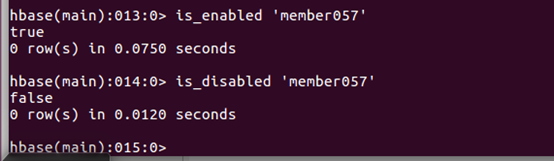
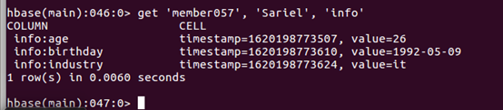

# Hbase实验二

## 1、一般操作

### 查询服务器状态

```
status
```


### 查询Hbase版本

```
version
```

### 查看所有表

```
version
```


## 2、增删改

### 创建一个表

```
create 'member057','member_id','address','info'
```


### 获得表的描述

```
describe 'member057' 
```


### 添加一个列族

```
alter 'member057','id'
```


### 添加数据

- ### 在HBase  shell中，我们可以通过put命令来插入数据。列族下的列不需要提前创建，在需要时通过：来指定即可。添加数据如下

  ```
  put 'member057', 'debugo','id','11'
  put 'member057', 'debugo','info:age','27'
  put 'member057', 'debugo','info:birthday','1991-04-04'
  put 'member057', 'debugo','info:industry', 'it'
  put 'member057', 'debugo','address:city','Shanghai'
  put 'member057', 'debugo','address:country','China'
  put 'member057', 'Sariel', 'id', '21'
  put 'member057', 'Sariel','info:age', '26'
  put 'member057', 'Sariel','info:birthday', '1992-05-09'
  put 'member057', 'Sariel','info:industry', 'it'
  put 'member057', 'Sariel','address:city', 'Beijing'
  put 'member057', 'Sariel','address:country', 'China'
  put 'member057', 'Elvis', 'id', '22'
  put 'member057', 'Elvis','info:age', '26'
  put 'member057', 'Elvis','info:birthday', '1992-09-14'
  put 'member057', 'Elvis','info:industry', 'it'
  put 'member057', 'Elvis','address:city', 'Beijing'
  put 'member057', 'Elvis','address:country', 'china
  ```

  

### 查看表数据

```
scan 'member057'
```


### 删除一个列族

```
alter 'member057', {NAME => 'member_id', METHOD => 'delete'
```


### 删除列

- 通过delete命令，我们可以删除id为某个值'info:age' 字段，接下来的get就无值了：

  ```
  delete 'member057','debugo','info:age'
  get 'member057','debugo','info:age'
  ```

  

- 删除整行的值，用deleteall命令

  ```
  deleteall 'member057','debugo'
  get 'member057','debugo'
  ```

  

- 通过enable和disable来启用/禁用这个表，相应的可以通过is_enabled和is_disabled来检查表是否被禁用

  ```
  is_enabled 'member057'
  is_disabled 'member057'
  ```

  

  

- 使用exists来检查表是否存在

  ```
  exists 'member057'
  ```

  

- 删除表需要先将表disable

  ```
  disable 'member057'
  drop 'member057'
  ```

  

## 3、查询

### 查询表中有多少行，用count命令：

```
count 'member057'
```


### get

- 获取一个id的所有数据

  ```
  get 'member057', 'Sariel'
  ```

  

- 获得一个id，一个列族（一个列）中的所有数据：

  ```
  get 'member057', 'Sariel', 'info'
  ```

  

### 查询整表数据

```
scan 'member057'
```


### 扫描整个列族

```
scan 'member057', {COLUMN=>'info'}
```


### 指定扫描期中的某个列

```
scan 'member057', {COLUMNS=> 'info:birthday'}
```


- ### 除了列（COLUMNS）修饰词外，HBase 还支持 Limit（限制查询结果行数），STARTROW（ROWKEY 起始行。会先根据这个 key 定位到 region，再向后扫描）、STOPROW(结束行)、TIMERANGE（限定时间戳范围）、VERSIONS（版本数）、和 FILTER（按条件过滤行）等。比如我们从 Sariel 这个 rowkey 开始，找下一个行的最新版本：

  ```
  scan 'member057', { STARTROW => 'Sariel', LIMIT=>1,
  VERSIONS=>1}
  ```

  

### Filter 是一个非常强大的修饰词，可以设定一系列条件来进行过滤。比如我们要限制某个列的值等于 26

```
scan 'member057', FILTER=>"ValueFilter(=,'binary:26')"
```


### 值包含 6 这个值：

```
scan 'member057', FILTER=>"ValueFilter(=,'substring:6')"
```


### 列名中的前缀为 birth 的

```
scan 'member057', FILTER=>"ColumnPrefixFilter('birth') "
```


### FILTER 中支持多个过滤条件通过括号、AND 和 OR 的条件组合

```
scan 'member057', FILTER=>"ColumnPrefixFilter('birth') AND
ValueFilter ValueFilter(=,'substring:1988')"
```


### PrefixFilter 是对 Rowkey 的前缀进行判断,这是一个非常常用的功能。

```
scan 'member057', FILTER=>"PrefixFilter('E')"
```

